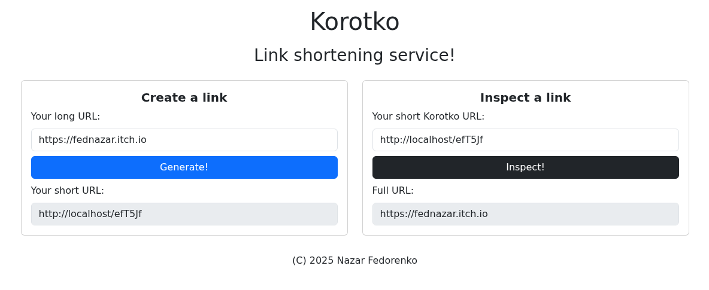

# Korotko

Simple link shortening service with backend based on ASP.NET Core Web API
and frontend written in JS (without frameworks) and styled with Bootstrap.

## Running locally

### API

- Install .NET 9.0 SDK
- Install and run MariaDB (or MySQL)
- Install and run Redis
- Clone the repository
- Run `dotnet restore` command to install dependencies
- Rename Korotko.API/appsettings.Example.json to appsettings.json
- Provide connection strings for MariaDB (ConnectionStrings.MariaDB)
  and Redis (ConnectionStrings.Redis), short ID alphabet (IDs.Alphabet),
  minimum short ID length (IDs.MinLength), your website URL (Website.URL)
  inside of Korotko.API/appsettings.json
- Run `dotnet ef database update` to create the database (make sure
  that MariaDB is running)
- Go to Korotko.API folder (`cd Korotko.API`)
- Run `dotnet publish -c Release` to build it in Release mode
- Run the API using `dotnet Korotko.API.dll`

### Web server

- Install Apache HTTP server
- Enable mod_rewrite module
- Set `AllowOverride All` for your DocumentRoot folder
- Copy all of the files from Korotko.Web/static to your DocumentRoot folder
- Run the web server

## Running using Docker Compose

Make a .env file based on the example in .env_example and run the server using `docker compose up --build`.

## API documentation

Go to Korotko.API folder and run `dotnet run`. This will run the server 
in development mode. Go to `[your server address]/swagger` in your 
browser to read the API documentation.

## License

This project is licensed under the MIT license. Read the LICENSE file
for more details.

(C) 2025 Nazar Fedorenko